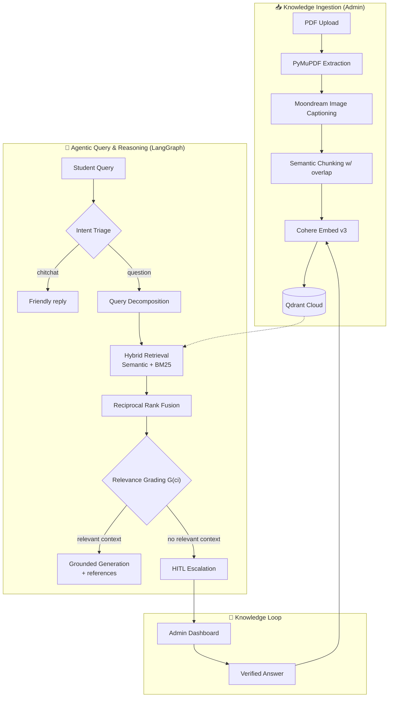

# 🎓 ISKOLARChat

**An Agentic RAG-powered academic assistant for Isabela State University** — students ask questions in English, Filipino, or Taglish and get answers grounded on official university documents, with references. When the AI can't answer reliably, a human admin steps in, and the verified answer feeds back into the knowledge base.

> Thesis project · Isabela State University · evaluated with the RAGAS framework against a standard-RAG baseline

---

## ✨ Features

- 💬 **Agentic RAG chat** — intent triage → query decomposition → hybrid retrieval → relevance grading → grounded generation
- 🔍 **Hybrid retrieval** — semantic search (Cohere Embed v3 + Qdrant) fused with keyword search (BM25) via **Reciprocal Rank Fusion**
- 🧑‍⚖️ **Relevance grading G(cᵢ)** — every retrieved chunk is graded against the query before generation, minimizing hallucination
- 🙋 **Human-in-the-Loop (HITL)** — unanswerable queries escalate to an admin dashboard; verified answers are **re-ingested into the knowledge base** (knowledge loop)
- 📄 **Multimodal ingestion** — PyMuPDF text extraction, tables → markdown, embedded images captioned by **Moondream**
- 🖼️ **Student file & image Q&A** — attach a PDF/DOCX/TXT or a photographed document; images are read by a vision LLM (document OCR)
- 🎛️ **Model picker** — Claude-style selector for model variant (Flash/Pro/R1) and thinking effort (Low/Medium/Max)
- 🗂️ **Persistent chat history**, 🌗 light/dark mode, ⚡ live-updating admin dashboards
- 🔐 Supabase Auth + Row-Level Security, role-based access (student / admin / superadmin), per-user rate limiting

## 🏗️ Architecture



## 🧰 Tech Stack

| Layer          | Technology                                                                 |
| -------------- | -------------------------------------------------------------------------- |
| Frontend       | React 18 + Vite, React Router, Supabase JS                                 |
| Backend        | Python, FastAPI, LangGraph                                                 |
| Auth & DB      | Supabase (Postgres + RLS + Storage)                                        |
| Vector DB      | Qdrant Cloud                                                               |
| Embeddings     | Cohere Embed v3 (1024-dim)                                                 |
| Keyword search | BM25 (rank-bm25) + RRF fusion                                              |
| LLM            | Gemini 3.5 via Google AI Studio (configurable OpenAI-compatible endpoint)   |
| Vision         | Moondream (ingestion captioning) + Gemini multimodal document image Q&A     |
| PDF processing | PyMuPDF (fitz)                                                             |
| Evaluation     | RAGAS (faithfulness, answer relevancy)                                     |

## 🚀 Setup

### 1. Supabase

Create a project, then run the migrations in the SQL Editor, in order:
`supabase/migrations/0001_consolidated_schema.sql` → `0002_chat_history.sql` → `0003_query_actions.sql` → `0004_admin_application_trigger.sql` → `0005_hitl_conversation_link.sql` → `0006_document_queue_status.sql` → `0007_shared_rate_limits.sql` → `0008_durable_document_ingestion.sql` → `0009_knowledge_index_version.sql` → `0010_atomic_admin_review.sql` → `0011_production_security_hardening.sql`

Create a superadmin: Dashboard → Authentication → Add user (auto-confirm), then:

```sql
UPDATE profiles SET role = 'superadmin' WHERE email = 'your-superadmin@email.com';
```

### 2. Frontend

```bash
npm install
# create .env.local with:
#   VITE_SUPABASE_URL=...
#   VITE_SUPABASE_ANON_KEY=...
npm run dev
```

### 3. Backend

```bash
cd backend
python -m venv .venv && .venv\Scripts\activate
pip install -r requirements.txt
# Create .env and add your Supabase, Qdrant, Cohere, and Gemini keys.
uvicorn app.main:app --reload --port 8000
```

See [backend/README.md](backend/README.md) for the full architecture-to-code mapping and the RAGAS evaluation harness.

Before handling university data, complete the [production deployment checklist](docs/production-checklist.md).

The portable Google Colab notebook, backend bundle, and result snapshot are grouped in [colab/](colab/README.md).

## 🔒 Security

- Supabase **Row-Level Security** on every table; self-service role escalation blocked at the database level
- All API endpoints verify the Supabase JWT; admin endpoints require an admin/superadmin profile role
- Per-user **rate limiting** on LLM-backed endpoints
- Model variants **whitelisted server-side** — clients can't request arbitrary models
- Secrets live only in gitignored `.env` files; the service-role key never reaches the browser

## 📜 License & Context

Academic thesis project for Isabela State University. The comparison baseline ("EduChat", standard RAG) and RAGAS evaluation results are documented in the accompanying thesis.
